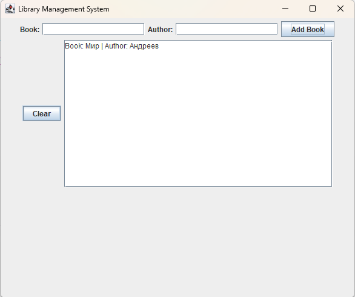

# 📚 Library Management System

Полнофункциональная система управления библиотекой на Java Swing.

## ✨ Особенности

• 📚 Добавление книг  
• ✍️ Добавление автора  
• 📋 Отображение списка книг  
• 🗑 Очистка списка  

## 🚀 Быстрый запуск

1. Скачать проект  
2. Открыть в IntelliJ IDEA  
3. Запустить файл LibraryManagement.java  
4. Использовать приложение  

## 📷 Скриншоты

## 🛠 Технологии

• Java  
• Java Swing  
• AWT  

